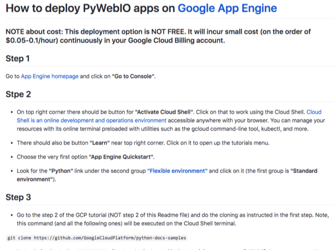
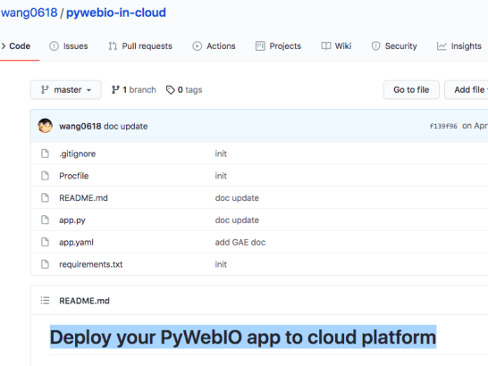

## Check out these tutorials on deploying your PyWebIO app to the cloud.

------------------------------------------------------------------------

### How to deploy PyWebIO apps on Google App Engine
#### by Tirthajyoti Sarkar
* GAE

<!--truncate-->
-
### Deploy your PyWebIO app to cloud platform
#### by Weimin Wang
* GAE, Heroku

