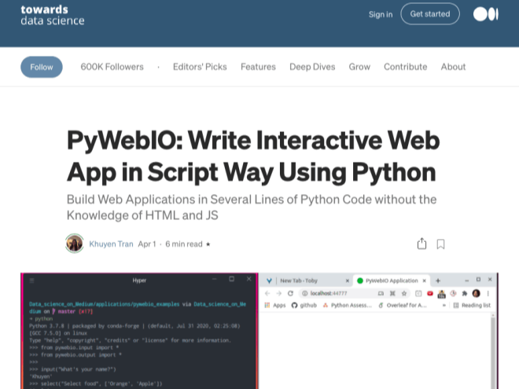

### Check out this awesome getting started tutorial by Khuyen Tran.

-------------------------------------------------------------------

### PyWebIO: Write Interactive Web App in Script Way Using Python
#### by Khuyen Tran
* pip command to install PyWebIO
* Input & output modules
* Two sample apps

Happy Coding!