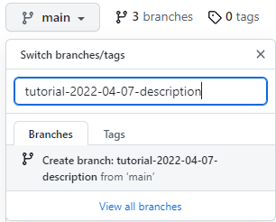
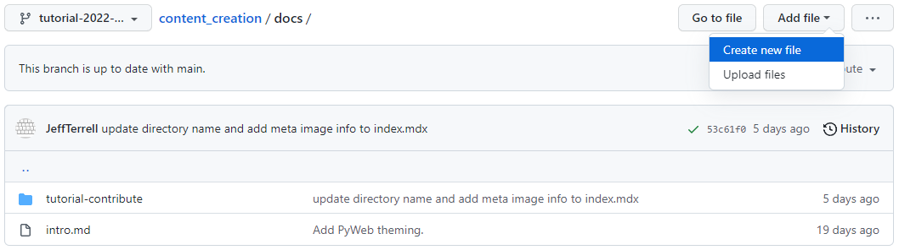
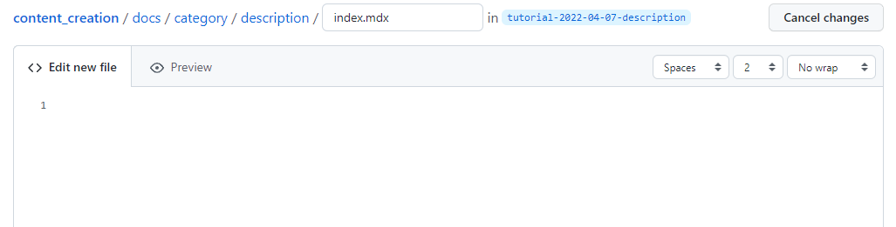
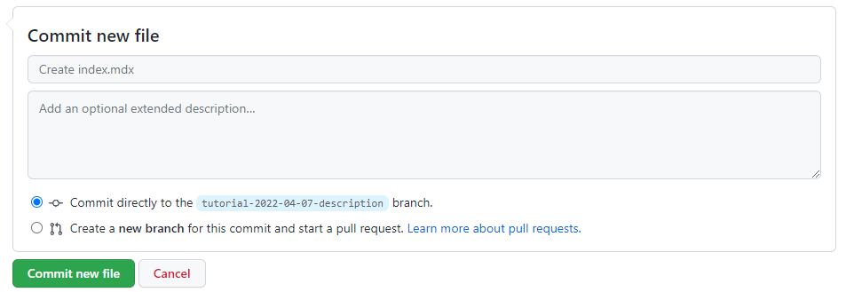
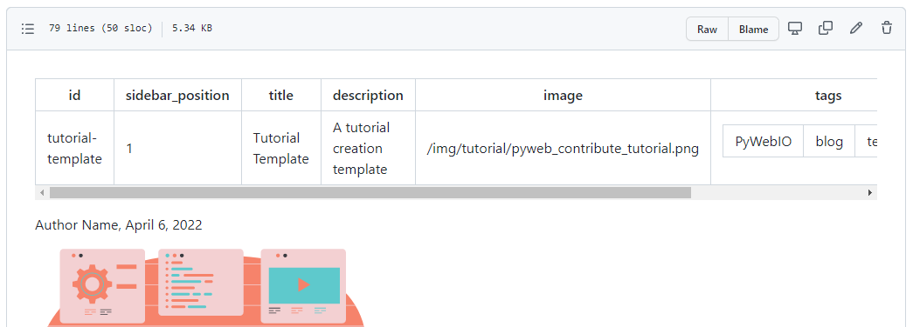
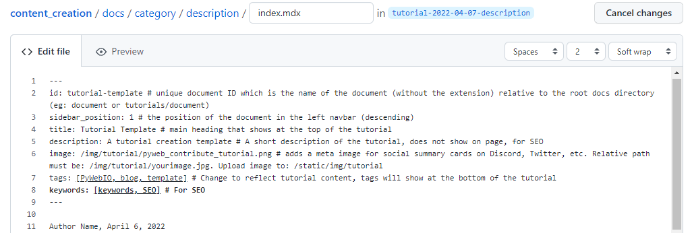
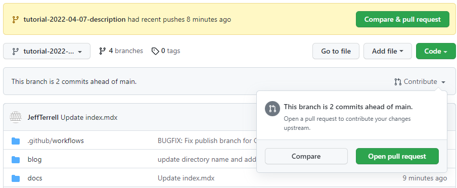
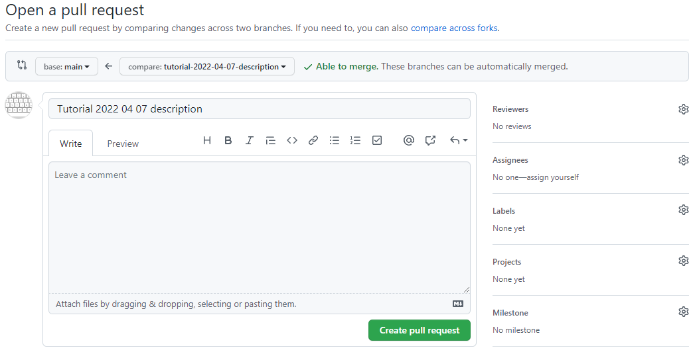
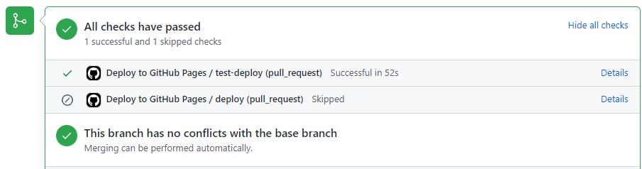

*Jeff Terrell, April 6, 2022*


This tutorial will guide you through the tutorial creation process for PyWeb.io. 

**You will learn how to:**

* Create a separate GitHub branch
* Add a new directory and Markdown file (.mdx)
* Create your tutorial from a provided template
* Add metadata
* Submit a pull request

Let's dive in!


## Requirements


* Access to the PyWeb.io content creation GitHub repository - [Click Here!](https://github.com/pywebio/content_creation)


## Create New Branch


From the content_creation repository, let's begin with creating a new branch that will contain your soon to be created .mdx file.



To create a new branch as shown above:
* Click the grey drop-down button ( main)
* Type the name of the new branch in the input box
  * **Format:** tutorial-date-description
    * e.g.`tutorial-2022-04-07-mongoDB`
* Click "Create branch"

You will automatically be directed to the newly created branch.


## Add New Directory And Markdown File




Navigate to the docs directory of the repo, click the "Add File" button, and then select "Create new file".



In the input box replace "Name your file..." with the new directory and index.mdx file for your tutorial.

:::tip Note

If there is not an appropriate category for your tutorial you will need to create one.

:::  

* **Format:** content_creation/docs/category/description/index.mdx 
  * e.g.`content_creation/docs/database-integration/mongoDB/index.mdx`



Next, scroll to the bottom of the page, ensure the "Commit directly to the `tutorial-date-description` branch" option is selected and click the green "Commit new file" button.

If you created a new category, follow the steps in the next section ["Create The .json File"](#create-the-json-file). Otherwise, continue on to ["Compose The Tutorial".](#compose-the-tutorial)


## Create The .json File

```
content_creation
│   README.md
│   file001.txt    
│
└───docs
            │   file011.txt
            │   file012.txt
            │
            └───category
                        │   _category_.json
                        │   
                        │   
                        └───description
                                    │   index.mdx
                                    │   image.jpg
```


The category .json file is used to give the category a title and order position (ascending) in the left navbar. The .json file belongs in the category directory and must be created exactly as shown:

```_category_.json```

Next, add two fields, lable and position to the .json file.
```
{
  "label": "New Category",
  "position": 5
}
```


## Compose The Tutorial




To make creating your tutorial easier, we have a template you can copy and paste to help get you started. 

* [Tutorial template](https://github.com/pywebio/content_creation/tree/main/static/template/tutorial-template.mdx) 


To use the template, click the "Raw" button on the right side of the screen, and highlight and copy the entire document.



Now, navigate to the newly created directory for your tutorial, select the index.mdx file and click the "pencil" icon on the right side of the screen. Paste the template into your file to begin creating your tutorial. Your index.mdx file should look similar to the screenshot above.

You can now begin creating your content! Feel free to improvise and make it your own, the template is not the "law", be creative and have fun, but try to follow the general layout of the template as well (thanks :smile:). 


## Add Metadata 


At the top of your file in between the three dashes is the front matter which contains fields (metadata) that need to be changed for each blog post or tutorial.

Follow the instructions below to ensure your file contains valuable metadata, and social card components are displayed correctly.
<details>
  <summary><b>Metadata Instructions</b></summary>
  <div style={{backgroundColor: ''}}>
    <li><b>id:</b> unique document ID which is the name of the document (without the extension) relative to the root docs directory (e.g., document or tutorials/document)</li>
    <li><b>sidebar_position:</b> the position of the document in the left navbar (descending)</li>
    <li><b>title:</b> the H1 main heading of the tutorial.</li>
    <li><b>description:</b> include a short description of the tutorial. This will not be visible anywhere on the page and is for SEO purposes.</li>
    <li><b>image:</b> adds a meta image for social summary cards on Discord, Twitter, etc. Upload image to: /static/img/tutorial. Relative path must be: /img/tutorial/yourimage.jpg.</li>
    <li><b>tags:</b> include several tags relevent to the subject matter of your tutorial to make finding similar content easier for other readers.</li>
    <li><b>keywords:</b> include several keywords describing the main topics of the tutorial for SEO purposes.</li>
  </div>  
</details>
<br></br>


## Submit




Navigate to the home page of your branch and click the green "Compare & pull request" button residing in the yellowish colored box displaying your branch name. 

:::tip Note

You can also select the " Contribute" drop down and click the green "Open pull request" button.

:::

<br></br>



You will be taken to the "Open a pull request" screen where you can choose to add a reviewer by clicking the ⚙️ icon next to "Reviewers". Select a reviewer and click the green "Create pull request" button and that's it, you're done! A PyWeb.io team member will review your pull request and assuming everything looks good, your tutorial will be deployed.




## Conclusion


This article describes how to create and submit a tutorial to the PyWeb.io blog. 

If you have any further questions, comments, feedback, etc. [please contact the PyWeb.io team](mailto:hey@pyweb.io)