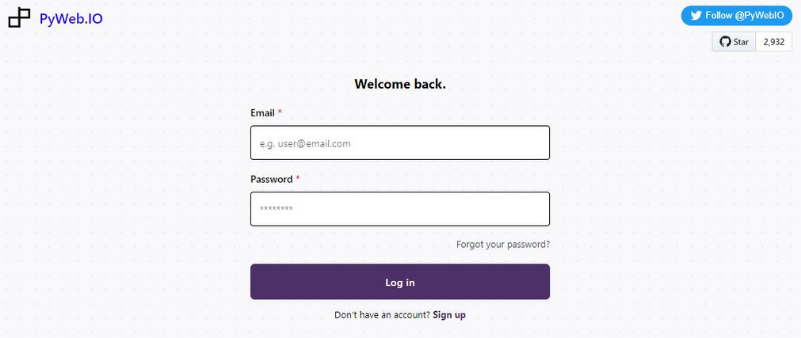
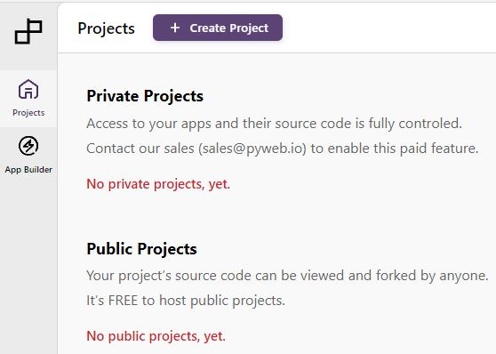
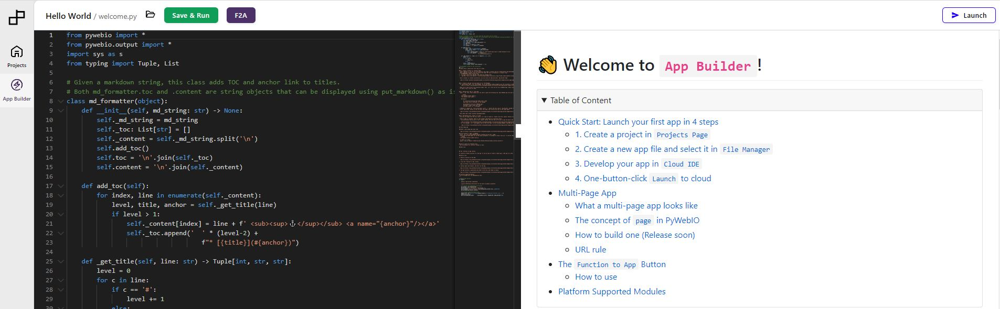
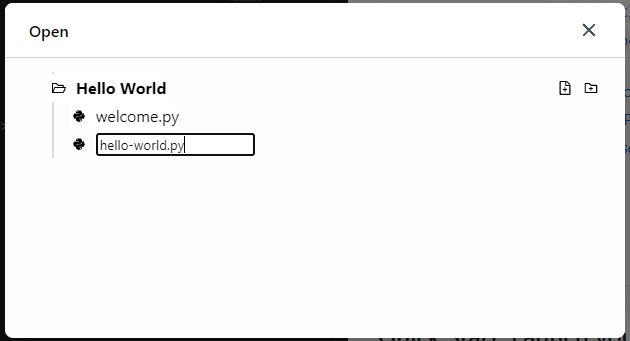

*Jeff Terrell, April 27, 2022*

The PyWeb Builder (platform as a service) is a fully managed service that provides PyWeb.io developers with the ability to build web functions and deploy them as cloud apps with a single-button-click. Building your first app is quick and easy, and with just a few steps you will have a fully deployed web app. 

**This tutorial will guide you through:**
* The sign-up/login process
* Creating a project
* Building a simple "Hello World" web app
* Deploying your web app. 

Let's get started!

## Requirements

First, you will need access to PyWeb Builder. Grab an invitation code **here**, just introduce yourself and ask for a code in the #community text channel.

If you already have an account or invitation code, login or sign-up **here**.

* Access to PyWeb Builder. Grab an invitation code [**here**](https://discord.gg/MvaCcg76Z7)
  * Already have an account or invitation code? Login or sign-up [**here**](https://build.pyweb.io/accounts/login)

## Step 1 - Create Project

After logging in, you will be brought to your dashboard which is used primarily to view your projects. Of course, there are no projects yet, so lets create one! Start by clicking the purple "Create Project" button at the top of the screen. **Remove**Assuming, you have built no previous projects, your dashboard should like the image above

Next, enter a project a name, a short description, and a "Slug" which is simply the URL path of your web app. Leave the "Project Type" as public and click the "Create" button

or

Fill in the required fields:

* Name - The title of your project
* Description - A short description of your project
* Slug - the URL path of your web app (URLs follow this pattern: {username}.pyweb.io/{project_slug}/{python_filename})
* Project Type - Leave the "Public" option checked

## Step 2 - Build App

You will be brought to the App Builder page which consists of two main sections, a code editor on the left and web preview window on the right.
:::tip Note

Click the "Save & Run" button to replace the 502 Bad Gateway message and display the welcome.py app in the web preview window

:::

### Create New .py File

Before building your first web app, follow the steps below to create a new .py file in your Hello World project.

  * Click the open folder icon to the left of the green "Save & Run" button
  * Click the + plus document icon on the right
  * Type hello-world.py in the input box and hit "enter"
  * Click the hello-world.py file

You will now be brought back the main screen with the hello-world.py file ready for editing.  

### Lets Code

## Step 3 - Launch App

