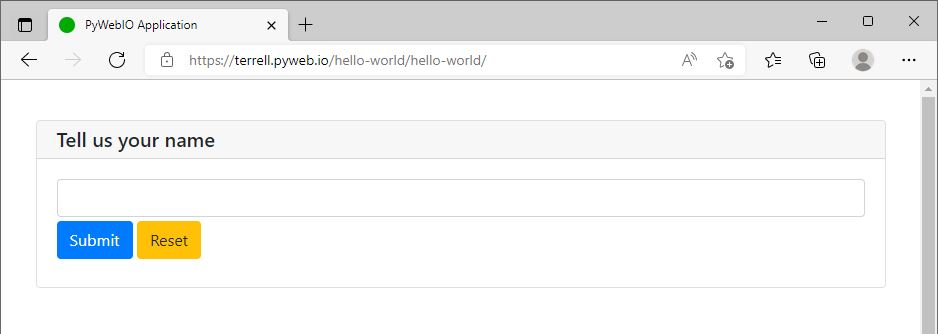

export const Button = ({children, backgroundColor, fontColor, borderStyle, borderColor}) => (
  <span
    style={{
      backgroundColor: backgroundColor,
      borderRadius: '5px',
      borderWidth: 1,
      borderStyle: borderStyle,
      borderColor: borderColor,
      color: fontColor,
      fontFamily: 'Segoe UI',
      fontSize: '0.8rem',
      fontWeight: '600',
      paddingTop: '0.3rem',
      paddingBottom: '0.35rem',
      paddingLeft: '1.0rem',
      paddingRight: '1.0rem',
    }}>
    {children}
  </span>    
)


*Jeff Terrell, April 27, 2022*


The PyWeb Builder (platform as a service) is a fully managed service that provides PyWeb.io developers with the ability to build web functions and deploy them as cloud apps with a single-button-click. Building your first app is quick and easy, and with just a few steps you will have a fully deployed web app. 

**This tutorial will guide you through:**
* The sign-up/login process
* Creating a project
* Building a simple Hello World web app
* Deploying a web app

Let's get started!

## Requirements


* Access to PyWeb Builder. Grab an invitation code [**here**](https://discord.gg/MvaCcg76Z7), just introduce yourself and ask for a code in the #community text channel.
* Already have an account or invitation code? Login or sign-up [**here**](https://build.pyweb.io/accounts/login)


## Step 1 - Create Project


After logging in, you will be brought to your dashboard which is used primarily to view your projects. Of course, there are no projects yet, so lets create one! Start by clicking the <Button backgroundColor='#4c3168' fontColor='white'>+ Create Project</Button> button at the top of the screen.


Fill in the required fields:

* **Name** - The title of your project
* **Description** - A short description of your project
* **Slug** - the URL path of your web app (URLs follow this pattern: {username}.pyweb.io/{project_slug}/{python_filename})
* **Project Type** - "Public" option checked (default)

Click the <Button backgroundColor='#0f9d58' fontColor='white'>Create ›</Button> button to finish creating the project.


## Step 2 - Build App


After creating the project, you will be brought to the App Builder page which consists of two main sections, a code editor on the left and web preview window on the right.
:::note

Click the <Button backgroundColor='#0f9d58' fontColor='white'>Save & Run</Button> button to replace the 502 Bad Gateway message and display the `welcome.py` app in the web preview window

:::

### Create New .py File

Before building your first web app, follow the steps below to create a new `.py` file in your Hello World project.

  1. Click the open folder 🗁 icon to the left of the green <Button backgroundColor='#0f9d58' fontColor='white'>Save & Run</Button> button to access the project's file manager
  2. Click the + plus document 🗋 icon on the right
  3. Type `hello-world.py` in the input box and hit your "enter" key
  4. Click the `hello-world.py` file


You will now be brought back to the app builder screen with the `hello-world.py` file ready for editing.  

### Add "Hello, world!" Code


Before adding any code, lets take a look at PyWeb.io's two main modules to better understand the functions used to build the Hello World app.
* **pywebio.input** - This module provides functions to get all kinds of input from a user. Checkout the [**PyWeb.io official documentation**](https://pywebio.readthedocs.io/en/latest/input.html#) for more details and a full list of input() functions.
* **pywebio.output** - This module provides functions that output many kinds of content to the user's browser. Checkout the [**PyWeb.io official documentaion**](https://pywebio.readthedocs.io/en/latest/output.html) for more details and a full list of output() functions.

:::note

Upon creating a new `.py` file, both of these modules are imported automatically with all* of their functions available

:::


Every `.py` app file must include a `main()` function to run. Running a .py file without `def main()` will save the file but not start the app. Let's add the code for the Hello World app:
```
def main():
    name = input('Tell us your name')
    put_text('%s says: "Hello, world!"' %name)
```

To test that the app is working properly, click the <Button backgroundColor='#0f9d58' fontColor='white'>Save & Run</Button> button, enter your name in the input box and click the <Button backgroundColor='#007bff' fontColor='white'>Submit</Button> button. The web preview page should refresh with the "Hello, world!" message and your name.


Congrats! You have just built your first PyWeb.io web application. Now, let's launch your app to the web!


## Step 3 - Launch App




PyWeb.io builder makes deploying an app incredibly simple. Follow these steps to deploy and view your Hello World app on the web:
1. Click the <Button backgroundColor='white' borderStyle='solid' borderColor='blue'>➢ Launch</Button> button in the top right corner of the screen
2. Click the 🚀 icon to copy the URL (URLs follow this pattern: {username}.pyweb.io/{project_slug}/{python_filename})
3. Open a new browser tab or window and paste the URL into the address bar

To stop hosting a web app, simply click the 🚫 icon.

:::note

Projects can contain multiple app files. In the file manager, any files that are launched will have the 🚀 icon attached.

:::


## Conclusion


This tutorial provides a step by step guide on how to create and launch a simple Hello World web application with PyWeb.io Builder.

If you have any further questions, comments, feedback, etc. [please contact the PyWeb.io team](mailto:hey@pyweb.io)