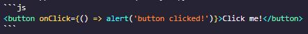

import Tabs from '@theme/Tabs';
import TabItem from '@theme/TabItem';

*Jeff Terrell, April 6, 2022*

**Quick Links:**
  - [Upload Assets](#upload-assets)
  - [Insert Image](#insert-image)
  - [Insert YouTube Video](#insert-youtube-video)
  - [Insert Code Snippet](#insert-code-snippet)
  - [Insert Admonition](#insert-admonition)
  - [Insert Tabs](#insert-tabs)
  - [Insert Details (drop-down)](#insert-details-drop-down)


## Upload Assets


From the directory containing the index.mdx file, click the "Add file" button and select "Upload files". You can upload as many files as needed from this screen. After you are finished, ensure the "Commit directly to the `blog-date-description` branch" option is selected and click the "Commit changes" button.

You will be re-directed to the home screen of the branch you just committed to, navigate back to the index.mdx file in the blog or docs(tutorials) directory to continue editing. To add the uploaded assets to your document, use the following relative file path:
* `./your_asset.jpg`


## Insert Image


```

```
Add an image by using the exclamation mark(!), followed by alt text in brackets[], and the relative path or URL to the image in parenthesis(). A title can be added in quotation marks("") as well after the relative path or URL.


## Insert YouTube Video


<iframe width="560" height="315" src="https://www.youtube.com/embed/qeHQrNrDdeg" title="YouTube video player" frameborder="0" allow="accelerometer; autoplay; clipboard-write; encrypted-media; gyroscope; picture-in-picture" allowfullscreen></iframe>

```
<iframe width="560" height="315" src="https://www.youtube.com/embed/qeHQrNrDdeg" 
title="YouTube video player" frameborder="0" allow="accelerometer; autoplay; 
clipboard-write; encrypted-media; gyroscope; picture-in-picture" allowfullscreen></iframe>
```

From the YouTube video you want to insert, click on "Share" and then select "Embed". Choose the checkbox options you desire and then copy and paste the code into your file.


## Insert Code Snippet


Code snippets allow users to quickly copy code with the click of a single button.
```js
<button onClick={() => alert('button clicked!')}>Click me!</button>
```
<button class="tutorial_button" onClick={() => alert('button clicked!')}>Click me!</button><br></br><br></br>


Wrap your code in three backticks ``` to use a code snippet. Here's the source code from the code snippet shown above.



## Insert Admonition


:::note Your Title

Your **important** content

:::

:::tip Your Title

Your **important** content

:::

:::info Your Title

Your **important** content

:::

:::caution Your Title

Your **important** content

:::

:::danger Your Title

Your **important** content

:::

Admonitions are useful to draw the reader's attention towards specific information. To use an admonition, wrap text in a set of 3 colons. You can specify the type/color (5 options) after the initial set of colons. For more information, check out this [documentation](https://docusaurus.io/docs/markdown-features/admonitions#).

```
:::tip Your Title

Your **important** content

:::
```


## Insert Tabs


<Tabs>
  <TabItem value="baseball" label="Baseball" default>
    <b>This is a baseball</b> ⚾
  </TabItem> 
  <TabItem value="basketball" label="Basketball">
    <b>This is a basketball</b> 🏀
  </TabItem>
  <TabItem value="football" label="Football">
    <b>This is a football</b> 🏈
  </TabItem>
</Tabs>

To insert tabs, wrap your content in the `<Tabs>` component. For more information on customizing tabs, check out this [documentation](https://docusaurus.io/docs/markdown-features/tabs).

```
<Tabs>
  <TabItem value="baseball" label="Baseball" default>
    <b>This is a baseball</b> ⚾
  </TabItem> 
  <TabItem value="basketball" label="Basketball">
    <b>This is a basketball</b> 🏀
  </TabItem>
  <TabItem value="football" label="Football">
    <b>This is a football</b> 🏈
  </TabItem>
</Tabs>
```


## Insert Details (drop-down)


<details>
  <summary><b>Details Drop-Down Box</b></summary>
  <div style={{backgroundColor: ''}}>
    <li><b>Bolded:</b> some information</li>
  </div>
  <details>
    <summary>Nested</summary>
      <li>More information</li>
  </details>  
</details>

Details drop-down boxes provide a clean look to grab a reader's attention. 

```
<details>
  <summary><b>I am details drop-down box</b></summary>
  <div style={{backgroundColor: ''}}>
    <li><b>Bolded:</b> some information</li>
  </div>
  <details>
    <summary>Nested</summary>
      <li>More information</li>
  </details>  
</details>
```
