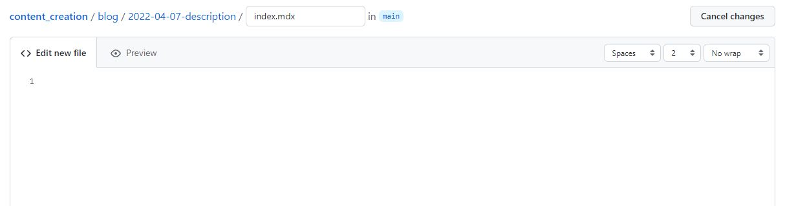
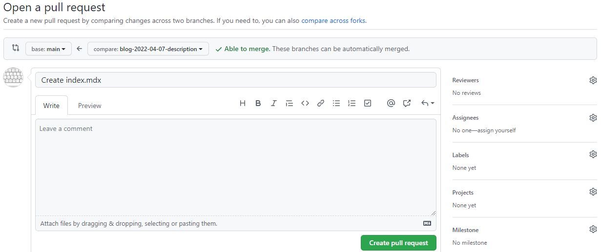

*Jeff Terrell, April 6, 2022*

This tutorial will guide you through the blog post creation process for PyWeb.io. You will learn how to:
* Create a separate GitHub branch
* Add a new directory and Markdown file (.mdx)
* Create your blog post from a provided template
* Add metadata
* Submit a pull request

Let's dive in!

## Requirements

* Access to the PyWeb.io content creation GitHub repository - [Click Here!](https://github.com/pywebio/content_creation)

## Create New Branch

From the content_creation repository, let's begin with creating a new branch that will contain your soon to be created .mdx file.

To create a new branch as shown above:
* Click the grey drop-down button ( main)
* Type the name of the new branch in the input box
  * **Format:** blog-date-description
    * e.g.`blog-2022-04-07-pyweb-release1.0`
* Click "Create branch"

You will automatically be directed to the newly created branch.

## Add New Directory And Markdown File

Navigate to the blog directory of the repo, click the "Add File" button, and then select "Create new file". 

From the next screen, enter the directory and file name for your blog post.
* **Format:** content_creation/blog/date-description/index.mdx 
  * e.g.`content_creation/blog/2022-04-07-pyweb-release1.0/index.mdx`

Next, scroll to the bottom of the page, ensure the "Commit directly to the `blog-date-description` branch" option is selected and click the green "Commit new file" button.

## Add An Author

Navigate to the blog directory and click on the authors.yml file. Click the "pencil" icon in the top right to begin editing the file. Follow the format as shown above to create your author profile. Now, scroll down the page and click the green "Commit changes" button.

:::tip Note

Your last name should be used as the main property. This profile will be used later in the front matter at the top of your blog post file (index.mdx).

:::

## Compose The Blog Post

To make creating your blog post easier, we have a template you can copy and paste to help get you started. 

* [Blog post template](https://github.com/pywebio/content_creation/tree/main/static/template/blog-template.mdx) 

To use the template, click the "Raw" button on the right side of the screen, and highlight and copy the entire document.

Now, navigate to the newly created directory for your blog post, select the index.mdx file and click the "pencil" icon on the right side of the screen. Paste the template into your file to begin creating your blog post. Your index.mdx file should look similar to the screenshot above.

You can now begin creating your content! Feel free to improvise and make it your own, the template is not the "law", be creative and have fun, but try to follow the general layout of the template as well (thanks :smile:). 

:::tip Note

Please use the `<!--truncate-->` marker to show summarized content on the blog landing page

:::

## Add Metadata 

At the top of your file in between the three dashes is the front matter which contains fields (metadata) that need to be changed for each blog post.

Follow the instructions below to ensure your file contains valuable metadata, and social card components are displayed correctly.

    
<b>Metadata Instructions</b>

    

      <li><b>slug:</b> the file path to the blog post after /blog/date-description and should be unique to the document. Choose a short name, can be identical to the description used for the directory (e.g. pyweb-release-1.0).</li>
      <li><b>title:</b> the H1 main heading of the blog post.</li>
      <li><b>description:</b> include a short description of the blog post. This will not be visible anywhere on the page and is for SEO purposes.</li>
      <li><b>image:</b> adds a meta image for social summary cards on Discord, Twitter, etc. Relative path must be: `/img/blog/yourimage.jpg`. Upload image to: `/static/img/blog`.</li>
      <li><b>authors:</b> this is where you add your author profile that was set up earlier.</li>
      <li><b>tags:</b> include several tags relevent to the subject matter of your post to make finding similar content easier for other readers.</li>
      <li><b>keywords:</b> include several keywords describing the main topics of the blog post for SEO purposes.</li>
    
   

  

## Submit

Navigate to the home page of your branch and click the green "Compare & pull request" button residing in the yellowish colored box displaying your branch name. 

:::tip Note

You can also select the " Contribute" drop down and click the green "Open pull request" button.

:::

  

You will be taken to the "Open a pull request" screen where you can choose to add a reviewer by clicking the ⚙️ icon next to "Reviewers". Select a reviewer and click the "Create pull request" button and that's it, you're done! A PyWeb.io team member will review your pull request and assuming everything looks good, your blog post will be deployed.

## Conclusion

This article describes how to create and submit a blog post to the PyWeb.io blog. 

If you have any further questions, comments, feedback, etc. [please contact the PyWeb.io team](mailto:hey@pyweb.io)