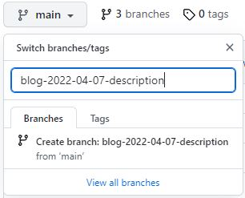
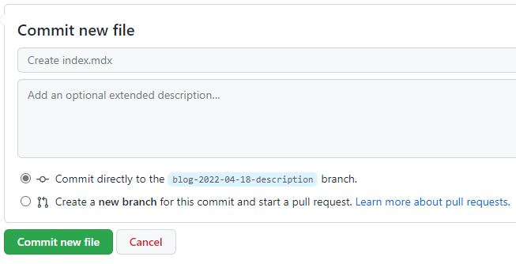

*Jeff Terrell, April 6, 2022*


This tutorial will guide you through the blog and tutorial creation process for PyWeb.io. You will learn how to:
* Create a separate GitHub branch
* Add a new directory and Markdown file (.mdx)
* Create your blog post or tutorial from a provided template
* Add assets and components
* Submit a pull request

Let's dive in!


## Requirements


* Access to the PyWebIO content creation GitHub repository - [Click Here!](https://github.com/pywebio/content_creation)


## Create New Branch


From the content_creation repository, let's begin with creating a new branch that will contain your soon to be created .MDX file.



To create a new branch as shown above:
* Click the grey drop-down button ( main)
* Type the name of the new branch in the input box
  * **Blog post** (blog-date-description)(e.g.```blog-2022-04-07-pyweb-release1.0```)
  * **Tutorial** (tutorial-date-description)(e.g.```tutorial-2022-04-07-mongoDB```)
* Click "Create branch"

You will automatically be directed to the newly created branch.


## Add New Directory And Markdown File


Navigate to the blog or relevant docs category (for tutorials) directory of the repo, click the "Add File" button, and then select "Create new file". 
:::caution Note

If there is not an appropriate category for your tutorial you will need to create one. In the input box replace "Name your file..." with the new directory and Markdown file for your blog post or tutorial.

:::

* **Blog Post** (format: content_creation/blog/date-description/index.mdx )
  * e.g.```content_creation/blog/2022-04-07-pyweb-release1.0/index.mdx```
* **Tutorial** (format: content_creation/docs/category/description/index.mdx) 
  * e.g.```content_creation/docs/database-integration/mongoDB/index.mdx```



Next, scroll to the bottom of the page, ensure the "Commit directly to the ```blog-date-description``` branch" option is selected and click the green "Commit new file" button.

If you created a new category, follow the steps in the next section ["Create The .json File"](#create-the-json-file). If you are contributing to a blog post and have not set up your author profile, [click here for the "Add an Author" section](#add-an-author-only-for-blog-post). Otherwise, continue on to ["Compose/Write The Blog Post or Tutorial"](#compose-the-blog-post-or-tutorial)


## Create The .json File

```
content_creation
│   README.md
│   file001.txt    
│
└───docs
            │   file011.txt
            │   file012.txt
            │
            └───category
                        │   _category_.json
                        │   
                        │   
                        └───description
                                    │   index.mdx
                                    │   image.jpg
```


The category .json file is used to give the category a title and order position (ascending) in the left navbar. The .json file belongs in the category directory and must be created exactly as shown:

```_category_.json```

Next, add two fields, lable and position to the .json file.
```
{
  "label": "New Category",
  "position": 5
}
```


## Add An Author (only for blog post)


Navigate to the blog directory and click on the authors.yml file. Click the "pencil" icon in the top right to begin editing the file. Follow the format as shown above to create your author profile. Note, your last name should be used as the main property. This profile will be used later in the front matter at the top of your blog post file (index.mdx).


## Compose The Blog Post or Tutorial


Navigate to the newly created directory, select the index.mdx file and click the "pencil" icon on the right side of the screen to begin creating your blog post or tutorial. To make this process easier, we have a template you can copy and paste to help get you started. 
* [Blog post template](https://github.com/pywebio/content_creation/tree/main/static/template/blog-template.mdx) 

* [Tutorial template](https://github.com/pywebio/content_creation/tree/main/static/template/tutorial-template.mdx)

To use the template, click the "Raw" button on the right side of the screen, and highlight and copy the entire document.

Your index.mdx file should now look similar to the screenshot above.

You can now begin creating your content! Feel free to improvise and make it your own, the template is not the "law", be creative and have fun, but try to follow the general layout of the template as well (thanks :smile:). Note, for a blog post, please use the ```<!--truncate-->``` marker to show summarized content on the blog landing page.


## Add Metadata 


At the top of your file in between the three dashes is the front matter which contains fields (metadata) that need to be changed for each blog post or tutorial.

Follow the steps below to ensure your file contains valuable metadata, and social card components are displayed correctly.
<details>
    <summary><b>Blog Post</b></summary>
    <div style={{backgroundColor: ''}}>
      <li><b>slug:</b> the file path to the blog post after /blog/date-description and should be unique to the document. Choose a short name, can be identical to the description used for the directory (e.g., pyweb-release-1.0).</li>
      <li><b>title:</b> the H1 main heading of the blog post.</li>
      <li><b>description:</b> include a short description of the blog post. This will not be visible anywhere on the page and is for SEO purposes.</li>
      <li><b>image:</b> adds a meta image for social summary cards on Discord, Twitter, etc. Relative path must be: ```/img/blog/yourimage.jpg```. Upload image to: ```/static/img/blog```.</li>
      <li><b>authors:</b> this is where you add your author profile that was set up earlier.</li>
      <li><b>tags:</b> include several tags relevent to the subject matter of your post to make finding similar content easier for other readers.</li>
      <li><b>keywords:</b> include several keywords describing the main topics of the blog post for SEO purposes.</li>
    </div>   
</details>

<details>
  <summary><b>Tutorial</b></summary>
  <div style={{backgroundColor: ''}}>
    <li><b>id:</b> unique document ID which is the name of the document (without the extension) relative to the root docs directory (e.g., document or tutorials/document)</li>
    <li><b>sidebar_position:</b> the position of the document in the left navbar (descending)</li>
    <li><b>title:</b> the H1 main heading of the blog post.</li>
    <li><b>description:</b> include a short description of the blog post. This will not be visible anywhere on the page and is for SEO purposes.</li>
    <li><b>image:</b> adds a meta image for social summary cards on Discord, Twitter, etc. Upload image to: ```/static/img/tutorial```. Relative path must be: ```/img/tutorial/yourimage.jpg```.</li>
    <li><b>tags:</b> include several tags relevent to the subject matter of your post to make finding similar content easier for other readers.</li>
    <li><b>keywords:</b> include several keywords describing the main topics of the blog post for SEO purposes.</li>
  </div>  
</details>
<br></br>


## Add Assets and Components


**Quick Links:**
  - [Upload Assets](#upload-assets)
  - [Insert Image](#insert-image)
  - [Insert YouTube Video](#insert-youtube-video)
  - [Insert Code Snippet](#insert-code-snippet)


### Upload Assets


From the directory containing the index.mdx file, click the "Add file" button and select "Upload files". You can upload as many files as needed from this screen. After you are finished, ensure the "Commit directly to the ```blog-date-description``` branch" option is selected and click the "Commit changes" button.

You will be re-directed to the home screen of the branch you just committed to, navigate back to the index.mdx file in the blog or docs(tutorials) directory to continue editing. To add the uploaded assets to your document, use the following relative file path:
* ```./your_asset.jpg```

### Insert Image

```

```
Add an image by using the exclamation mark(!), followed by alt text in brackets[], and the relative path or URL to the image in parenthesis(). A title can be added in quotation marks("") as well after the relative path or URL.

### Insert YouTube Video

<iframe width="560" height="315" src="https://www.youtube.com/embed/qeHQrNrDdeg" title="YouTube video player" frameborder="0" allow="accelerometer; autoplay; clipboard-write; encrypted-media; gyroscope; picture-in-picture" allowfullscreen></iframe>

```
<iframe width="560" height="315" src="https://www.youtube.com/embed/qeHQrNrDdeg" 
title="YouTube video player" frameborder="0" allow="accelerometer; autoplay; 
clipboard-write; encrypted-media; gyroscope; picture-in-picture" allowfullscreen></iframe>
```

From the YouTube video you want to insert, click on "Share" and then select "Embed". Choose the checkbox options you desire and then copy and paste the code into your file.

### Insert Code Snippet
Code snippets allow users to quickly copy code with the click of a single button.
```js
<button onClick={() => alert('button clicked!')}>Click me!</button>
```
<button class="tutorial_button" onClick={() => alert('button clicked!')}>Click me!</button><br></br><br></br>


Wrap your code in three backticks ``` to use a code snippet. Here's the source code from the code snippet shown above.


## Submit


Navigate to the home page of your branch and click the green "Compare & pull request" button residing in the yellowish colored box displaying your branch name. Note, you can also select the " Contribute" drop down and click the green "Open pull request" button.


You will be taken to the "Open a pull request" screen where you can choose to add a reviewer by clicking the ⚙️ icon next to "Reviewers". Select a reviewer and click the "Create pull request" button and that's it, you're done! A PyWebIO team member will review your pull request and assuming everything looks good, your blog post or tutorial will be deployed.


## Conclusion


This article describes how to create and submit a blog post or tutorial to the PyWeb.io blog. 

If you have any further questions, comments, feedback, etc. [please contact the PyWeb.io team](mailto:hey@pyweb.io)

