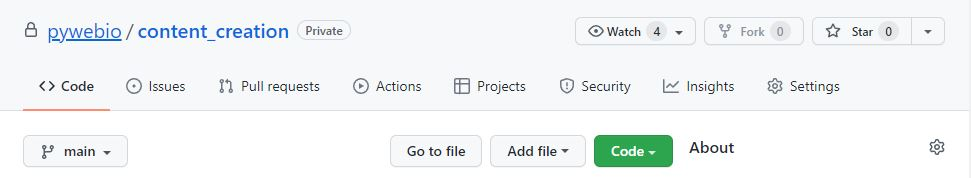
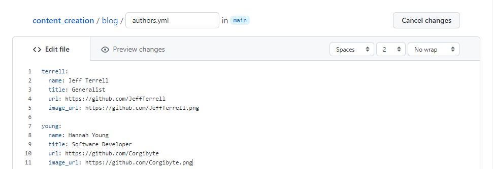
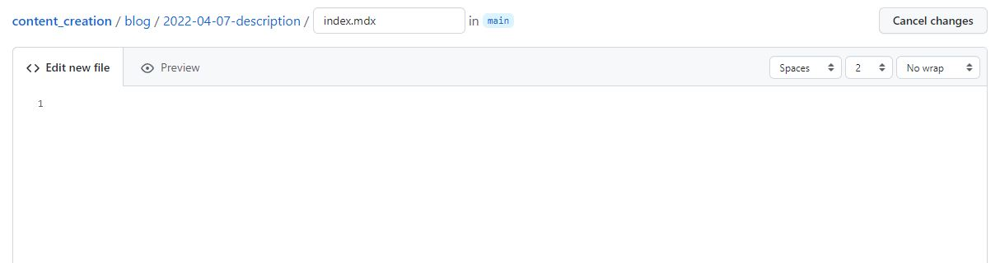
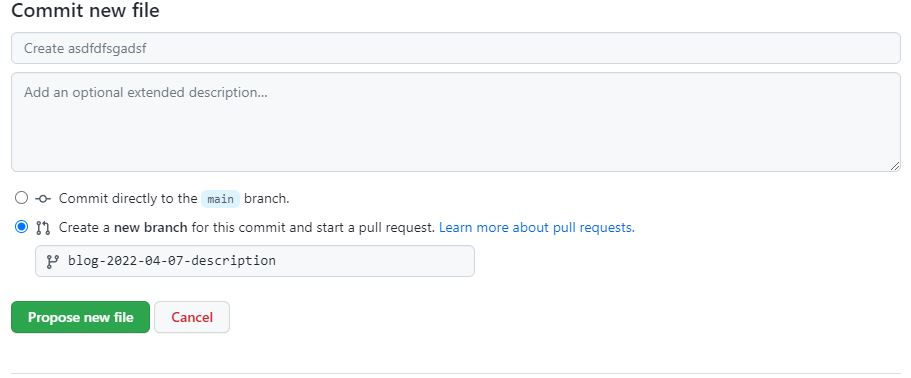
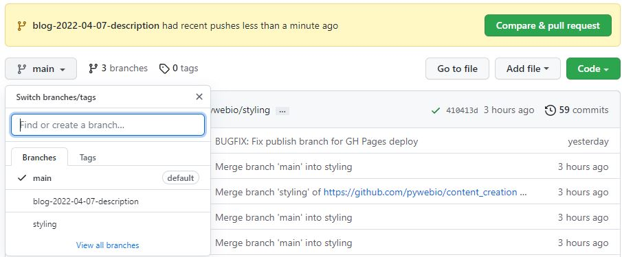
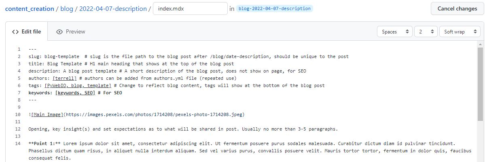
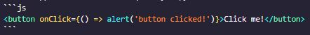
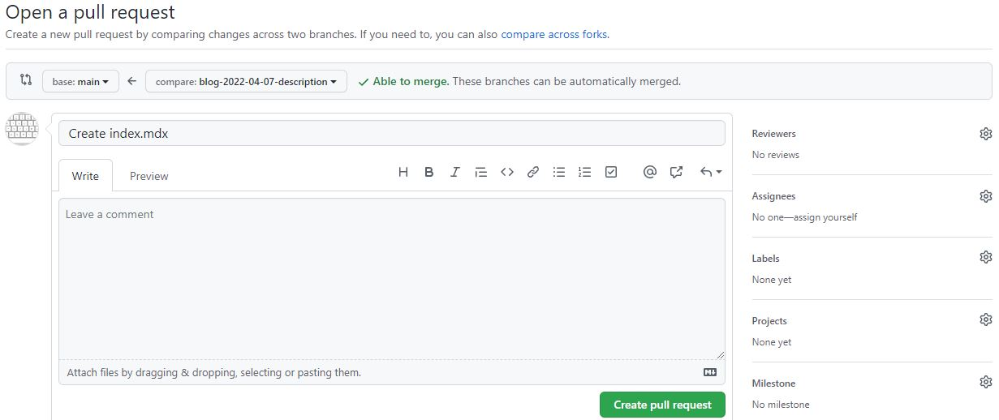

*Jeff Terrell, April 6, 2022*


This tutorial will guide you through the blog and tutorial creation process for PyWeb.io. Let's dive in!

## Base Step/Prerequisites/Requirements
* GitHub account - [Don't have an account?](https://github.com/join)


## Forking Content_Creation Directory
Let's begin with forking the pywebio/content-creation repository which is where your blog post will eventually be pushed to and deployed from.



Click the Fork button in the top of right of your screen. You will be redirected to the forked content_creation repository in your GitHub account.


## Adding An Author (only for blog post)



Navigate to the blog directory and click on the authors.yml file. Click the "pencil" icon in the top right to begin editing the file. Follow the format as shown above to create your author profile. Note, your last name should be used as the main property. This profile will be used later in the front matter field at the top of your blog post file (index.mdx).


## Adding New Directory And Markdown File



Navigate to the blog or docs (for tutorials) directory of the repo, click the "Add File" button, and then select "Create new file". 

In the input box replace "Name your file..." with the new directory and Markdown file for your blog post or tutorial. The directory and file should be created as shown below:
* Blog Post (format: content_creation/blog/date-description/index.mdx )
  * ```content_creation/blog/2022-04-07-pyweb-release1.0/index.mdx```
* Tutorial (format: content_creation/docs/category/description/index.mdx) 
  * ```content_creation/docs/database-integration/mongoDB/index.mdx```

#### Creating Tutorial Category (only for tutorial, if needed)
From the docs directory, click the "Add File" button, and then select "Create new file". Create the category as shown below:
* ```content_creation/docs/category/description/index.mdx```

Next, create a Json file that is used to give the category a title and order position (ascending) in the left navbar. The Json file belongs in the category directory and must be created exactly as shown below:
* ```_category_.json```

Finally, inside of curly braces {}, add two fields, lable and position to the Json file.
```
{
  "label": "New Category",
  "position": 5
}
```

### Commit the new directory and file



At the bottom of the page: 
* Select the "Create a new branch for this commit and start a pull request" option. 
* Name the branch with the following format:
  * For a blog post (blog-date-description)
    * ```blog-2022-04-07-pyweb-release1.0```
  * For a tutorial (tutorial-date-description)  
    * ```tutorial-2022-04-07-mongoDB```
* Click the "Propose new file" button to create the new branch with your directory and file.


## Creating The Blog Post or Tutorial



After creating the new branch you will be re-directed to the "Open a pull request" screen. Don't do anything here, instead click on the content_creation repo link at the top of the page and switch from the main branch to the branch you just created.

Navigate to the newly created directory, select the index.mdx file and click the "pencil" icon on the right side of the screen to begin creating your blog post or tutorial. To make this process easier, we have a template you can copy and paste to help get you started. 
* [Blog post template](https://github.com/pywebio/content_creation/tree/main/static/template/blog-template.md) 

* [Tutorial template](https://github.com/pywebio/content_creation/tree/main/static/template/tutorial-template.md)

To copy the template, click the "Raw" button on the right side of the screen, and highlight and copy the entire document.



Your index.mdx file should look similar to the screenshot above after copying and pasting the template Markdown code.

You can now begin creating your own blog post! Feel free to improvise and make it your own, the template is not the "law", be creative and have fun, but try to follow the general layout of the template as well (thanks :smile:). At the top of file in between the three dashes is the front matter which contains fields (metadata) that need to be changed for each blog post or tutorial.


## Adding Metadata


Follow the steps below to ensure your file contains valuable metadata and social card components are displayed correctly.

* **Needed for blog post**
  * ***slug:*** the file path to the blog post after /blog/date-description and should be unique to the document. Choose a short name, can be identical to the description used for the directory (e.g., pyweb-release-1.0).
  * ***title:*** the H1 main heading of the blog post.
  * ***description:*** include a short description of the blog post. This will not be visible anywhere on the page and is for SEO purposes.
  * ***image:*** adds a meta image for social summary cards on Discord, Twitter, etc. Relative path must be: ```/img/blog/yourimage.jpg```. Upload image to: ```/static/img/blog```.
  * ***authors:*** this is where you add your author profile that was set up earlier.
  * ***tags:*** include several tags relevent to the subject matter of your post to make finding similar content easier for other readers.
  * ***keywords:*** include several keywords describing the main topics of the blog post for SEO purposes.

* **Needed for tutorial**
  * ***id:*** unique document ID which is the name of the document (without the extension) relative to the root docs directory (e.g., document or tutorials/document)
  * ***sidebar_position:*** the position of the document in the left navbar (descending)
  * ***title:*** the H1 main heading of the blog post.
  * ***description:*** include a short description of the blog post. This will not be visible anywhere on the page and is for SEO purposes.
  * ***image:*** adds a meta image for social summary cards on Discord, Twitter, etc. Upload image to: ```/static/img/tutorial```. Relative path must be: ```/img/tutorial/yourimage.jpg```.
  * ***tags:*** include several tags relevent to the subject matter of your post to make finding similar content easier for other readers.
  * ***keywords:*** include several keywords describing the main topics of the blog post for SEO purposes.


## Adding Assets and Components
All assets need to be saved in the directory containing the index.mdx file. 


From your branch, click the "Add file" button and select "Upload files". You will have the option to either drog and drop or choose the files from a file explorer. You can upload as many files as needed from this screen. After you are finished, ensure the "Commit directly to the ```blog-date-description``` branch" option is selected and click the "Commit changes" button.

You will be re-directed to the home screen of the branch you just committed to, navigate back to the index.mdx file in the blog or docs(tutorials) directory to continue editing. To add the uploaded assets to your document, use the following relative file path:
* ```./your_asset.jpg```

### Inserting Images

```

```
Add an image by using the exclamation mark(!), followed by alt text in brackets[], and the relative path or URL to the image in parenthesis(). A title can be added in quotation marks("") as well after the relative path or URL.

### Inserting YouTube Videos

<iframe width="560" height="315" src="https://www.youtube.com/embed/qeHQrNrDdeg" title="YouTube video player" frameborder="0" allow="accelerometer; autoplay; clipboard-write; encrypted-media; gyroscope; picture-in-picture" allowfullscreen></iframe>

```
<iframe width="560" height="315" src="https://www.youtube.com/embed/qeHQrNrDdeg" 
title="YouTube video player" frameborder="0" allow="accelerometer; autoplay; 
clipboard-write; encrypted-media; gyroscope; picture-in-picture" allowfullscreen></iframe>
```

From the YouTube video you want to insert, click on "Share" and then select "Embed". Choose the checkbox options you desire and then copy and paste the code into your file.

### Inserting Code Snippets
Code snippets allow users to quickly copy code with the click of a single button.
```js
<button onClick={() => alert('button clicked!')}>Click me!</button>
```
<button class="tutorial_button" onClick={() => alert('button clicked!')}>Click me!</button><br></br><br></br>


Wrap your code in three backticks ``` to use a code snippet. Here's the source code from the code snippet shown above.



## Submitting


Navigate to the home page of your branch and click the green "Compare & pull request" button residing in the yellowish colored box displaying your branch name. Note, you can also select the "Contribute" drop down and click the green "Open pull request" button.



You will be taken to the "Open a pull request" screen where you can choose to add a reviewer by clicking the gear⚙️ icon next to "Reviewers". Select a reviewer and click the "Create pull request" button and that's it, you're done! A PyWebIO team member will review your pull request and assuming everything looks good, your blog post or tutorial will be deployed.


## Conclusion
This article describes how to create and submit a blog post or tutorial to the PyWeb.io blog. 

If you have any further questions, comments, feedback, etc. [please contact the PyWeb.io team](mailto:hey@pyweb.io)

