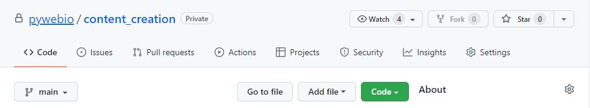
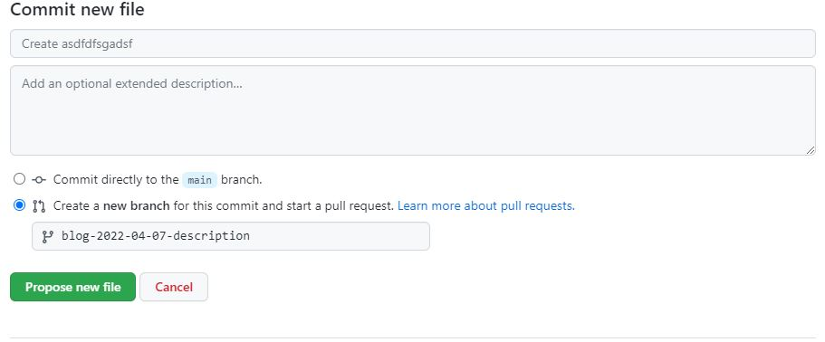

*Jeff Terrell, April 6, 2022*


Submitting a blog post doesn't have to be difficult, and hopefully you'll find the process easy to get through. This tutorial will guide you through the blog creation process step by step resulting in a completed and fully deployed blog post. Let's dive in!

## Base Step/Prerequisites/Requirements
* GitHub account - [Create GitHub account](https://github.com/join)


## Forking Content_Creation Directory
Let's begin with forking the pywebio/content-creation repository which is where your blog post will eventually be pushed to and deployed from.



Click the Fork button in the top of right of your screen. You will be redirected to the forked content_creation repository in your GitHub account.


## Adding An Author
Now that you have a clone of the content_creation repository, lets get you added as a contributing author. 


Navigate to the blog directory and click on the authors.yml file. Click the "pencil" icon in the top right to begin editing the file. Follow the format as shown above to create your author profile. Note, your last name should be used as the main property. This profile will be used later in the front matter field at the top of your blog post file (index.mdx).


## Adding New Directory And Markdown File
### Create a new directory and Markdown file


Navigate to the blog directory of the repo, click the "Add File" button, and then select "Create new file". 

In the input box replace "Name your file..." with the new directory and Markdown file for your blog post. The directory should be created with this path (content_creation/blog) and be named with the current date (yyyy-mm-dd). The file should be named index.mdx. Note, the blog post will be sorted in the left navbar under "Recent Posts" based on the date used. Example:
* content_creation/blog/2022-04-07-description/index.mdx

### Commit the new directory and file



Scroll to the bottom of the page and in the Commit new file box, select the "Create a new branch for this commit and start a pull request" option. This will give you the option to name the new branch you are creating. The branch should be named with the following format (blog-date-description). Example:
* blog-2022-04-07-description

Click the "Propose new file" button to create the new branch with your directory and file.


## Creating The Blog Post


After creating the new branch you will be re-directed to the Open a pull request screen. Don't do anything here, instead click on the content_creation repo link at the top of the page and switch from the main branch to the branch you just created by clicking the gray dropdown button (default is  main) near the top of the page.

Navigate to the newly created directory, select the index.mdx file and click the "pencil" icon on the right side of the screen to begin creating your blog post. To make this process easier, we have a template you can copy and paste to help get you started. [Click here to open a new window for the blog template.](https://github.com/pywebio/content_creation/tree/main/static/template/blog-template.md) To copy the template, click the "Raw" button on the right side of the screen, highlight and copy the entire document.


Your index.mdx file should look similar to the screenshot above after copying and pasting the template Markdown code.

You can now begin creating your own blog post! Feel free to improvise and make it your own, the template is not the "law", be creative and have fun, but try to follow the general layout of the template as well (thanks :smile:). The code at the top of file in between the three dashes is the front matter and contains fields that need to be changed for each blog post.
  * **slug:** the file path to the blog post after /blog/date-description and should be unique to the document. Choose a short name, can be identical to the description used for the directory (eg: pyweb-release-1.0).
  * **title:** the H1 main heading of the blog post.
  * **description:** include a short description of the blog post. This will not be visible anywhere on the page and is for SEO purposes.
  * **authors:** this is where you add your author profile that was set up earlier.
  * **tags:** include several tags relevent to the subject matter of your post to make finding similar content easier for other readers.
  * **keywords:** include several keywords describing the main topics of the blog post for SEO purposes.

Also note, there is a preview tab next to the "Edit file" tab that allows you to see how your blog post will appear after being deployed.


## Adding Images And Other Assets
Of course you will likely want to add images or other assets to your blog post. All of the assets need to be saved in the directory containing the index.mdx file. 


Make sure you are on the branch specific to your blog post and in the correct directory (blog/date-description), click the "Add file" button and select "Upload files". You will have the option to either drog and drop or choose the files from a file explorer. You can upload as many files as needed from this screen. After you are finished, ensure the "Commit directly to the ```blog-date-description``` branch" option is selected and click the "Commit changes" button.

You will be directed to the home screen of the branch you just committed to, navigate back to the index.mdx file in the blog directory to continue editing your blog post. Also, because the uploaded assets reside in the same directory as your index.mdx file they are very easy to access. Simply use the following relative file path:
* ./your_asset.jpg

### Inserting Images

```

```
Add an image by using the exclamation mark(!), followed by alt text in brackets[], and the relative path or URL to the image in parenthesis(). A title can be added in quotation marks("") as well after the relative path or URL.

### Inserting YouTube Videos

<iframe width="560" height="315" src="https://www.youtube.com/embed/qeHQrNrDdeg" title="YouTube video player" frameborder="0" allow="accelerometer; autoplay; clipboard-write; encrypted-media; gyroscope; picture-in-picture" allowfullscreen></iframe>

YouTube makes embedding a video very simple. From the YouTube video you want to insert, click on "Share" and then select "Embed". Choose the checkbox options you desire and then copy the code. Next, paste the code in your file and voila.

### Inserting Code Snippets
Code snippets allow users to quickly copy code with the click of a single button.
```js
<button onClick={() => alert('button clicked!')}>Click me!</button>
```
<button class="tutorial_button" onClick={() => alert('button clicked!')}>Click me!</button><br></br><br></br>


Wrap your code in three backticks ``` to use a code snippet. Here's the source code from the code snippet shown above.


## Submitting Blog Post


After you have completed your blog post and are satisfied with the end result it's time to submit your branch so that it can be merged with main branch and deployed to the web. Remember earlier when we skipped creating a pull request after creating the new branch? We are going to create the pull request now so the overlords of the PyWebIO blog know about your completed blog post. To do this, navigate to the home page of your branch and you will see a yellowish box with a green "Compare & pull request" button.


Click the button and on the next page choose a reviewer. This will help notify the person that there is a pull request for your newly created blog post. Next click the "Create pull request" button and that's it, you're done! A PyWebIO team member will review your pull request and assuming everything looks good, your blog post will be deployed to the PyWebIO blog.


## Conclusion
This article describes how to create and submit a blog post to the PyWeb.io blog. 

If you have any further questions, comments, feedback, etc. [please contact the PyWeb.io team](mailto:hey@pyweb.io)

