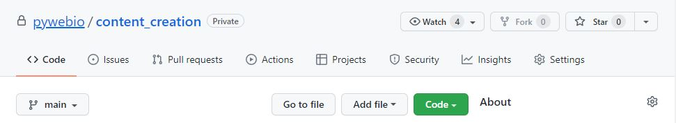
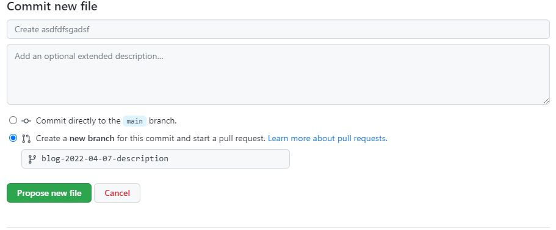
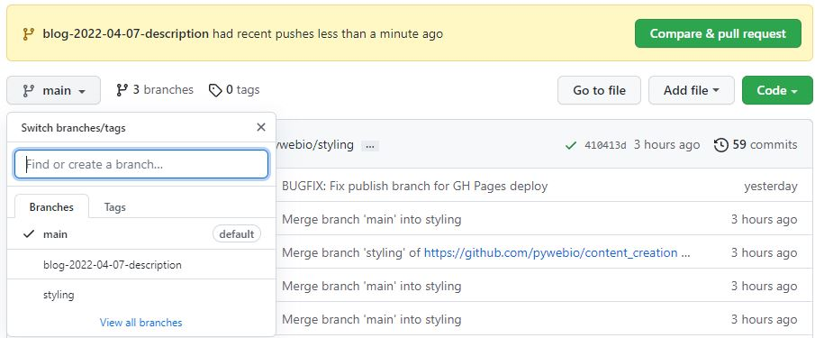
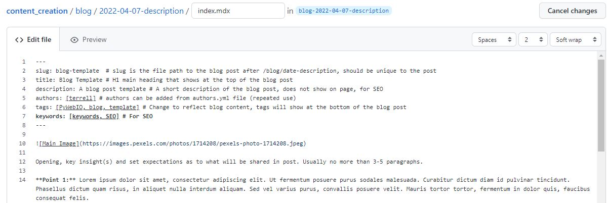
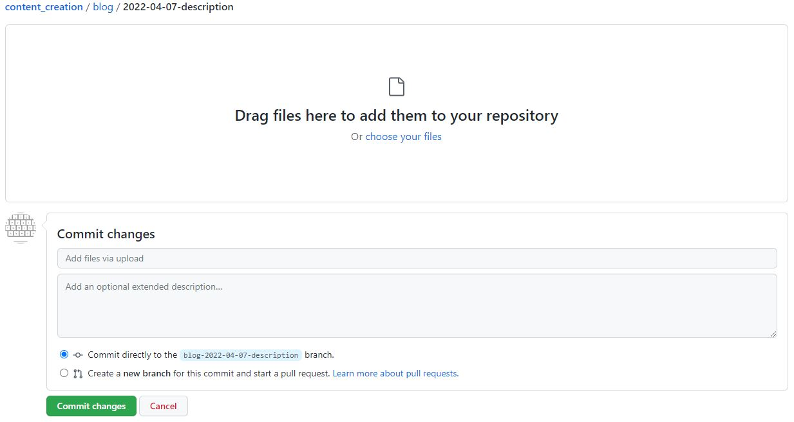
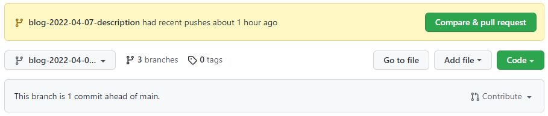

*Jeff Terrell, April 6, 2022*


Submitting a blog post doesn't have to be difficult, and hopefully you'll find the process easy to get through. This tutorial will guide you through the blog creation process step by step resulting in a completed and fully deployed blog post. Let's dive in!

## Base Step/Prerequisites/Requirements
* GitHub account - [Create GitHub account](https://github.com/join)


## Forking Content_Creation Directory
Let's begin with forking the pywebio/content-creation repository which is where your blog post will eventually be pushed to your GitHub account.


## Adding New Directory And Markdown File
Let's begin with forking the pywebio/content-creation repository which is where your blog post will eventually be pushed to your GitHub account.

<!--  -->

Click the Fork button in the top of right of your screen

Let's begin with creating the directory and blog file in the GitHub content-creation repository. Make sure you are in the main (default) branch of the repo, click the "Add File" button, and then select "Create new file". You will be directed to this screen:

<!--  -->

In the input box replace "Name your file..." with the new directory and Markdown file for your blog post. The directory should be created with this path (content_creation/blog) and be named with the current date (yyyy-mm-dd). The file should be named index.md. Example:
* content_creation/blog/2022-04-07/index.mdx

Now scroll to the bottom of the page and in the Commit new file box, select the "Create a new branch for this commit and start a pull request" option. This will give you the option to name the new branch you are creating. The branch should be named with the following format (blog-date-subject). Example:
* blog-2022-04-07-blog-tutorial

Click the "Propose new file" button to create the new branch with your directory and file.

<!--  -->


## Creating The Tutorial

After creating the new branch you will be re-directed to the Open a pull request screen. Don't do anything here, instead click on the content_creation repo link at the top of the page and switch from the main branch to the branch you just created by clicking the gray dropdown button near the top of the page.

<!--  -->

Navigate to the newly created directory, select the index.md file and click the "pencil" icon on the right side of the screen to begin creating your blog post. To make this process easier we have a template you can copy and paste to help get you started. [Click this link to open a new window for the blog template.](https://github.com/pywebio/content_creation/tree/main/static/template/blog-template.md)

Your index.md file should look similar to the screenshot below after copying and pasting the template Markdown code.

<!--  -->

You can now begin creating your own blog post! Feel free to improvise and make it your own, the template is not the "law", be creative and have fun but try to follow the general layout of the template as well (thanks :smile:). If you are creating a tutorial page that is simply a link to a YouTube video, this layout will be much simpler (header, brief description, video), and there are instructions here on how to emded the video in your tutorial document. Note, there is a preview tab next to the Edit file tab that allows you to see how your blog post will appear after being deployed.


## Adding Images And Other Assets
Of course you will likely want to add images or other assets to your blog post. All of the assets need to be saved in the directory containing the index.md file. Make sure you are on the branch specific to your blog post and in the correct directory (blog/date-description), click the "Add file" button and select "Upload files". You will have the option to either drog and drop or choose the files from a file explorer. You can upload as many files as needed from this screen. After you are finished, ensure the "Commit directly to the 'your branch' branch" option is selected and click the "Commit changes" button.

<!--  -->

You will be directed to the home screen of the branch you just committed to, simply navigate back to the index.md file in the blog directory to continue editing your blog post.

### Inserting Images
As the assets are now residing in the same directory as your index.md file they are very easy to access. Simply use the following Markdown code:
```

```

### Inserting YouTube Videos


## Submitting Blog Post
After you have completed your blog and are satisfied with the end result it's time to submit your branch so that it can be merged with main branch and deployed to the web. Remember earlier when we skipped creating a pull request after creating the new branch? We are going to create the pull request now so the overlords of the PyWebIO blog know about your completed blog post. To do this, navigate to the home page of your branch and you will see a yellowish box with a green "Compare & pull request" button.

<!--  -->

Click the button and on the next page choose a reviewer. This will notify the person that there is a pull request for your blog request. Next click the "Create pull request" button and that's it, you're done! A PyWebIO team member will review your pull request and assuming everything looks good, your blog post will be deployed to the PyWebIO blog.

<!--  -->


## Conclusion
Lorem ipsum dolor sit amet, consectetur adipiscing elit. In maximus vehicula augue at tincidunt. Duis et lorem dictum, gravida ante et, fermentum augue. Class aptent taciti sociosqu ad litora torquent per conubia nostra, per inceptos himenaeos. In rutrum vitae velit et auctor. Donec at ultrices est. Morbi in eros rutrum, sagittis massa vel, maximus quam. Suspendisse potenti.
