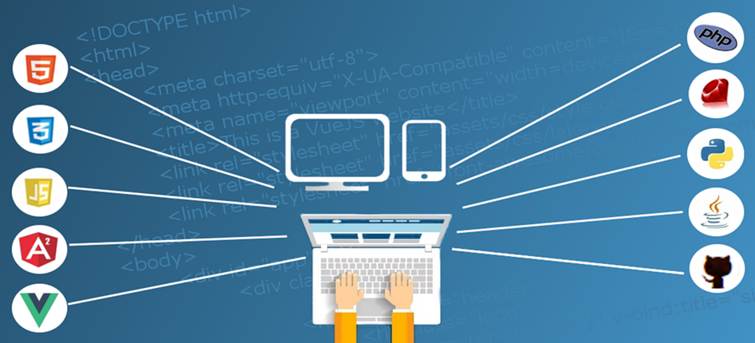

Opening, key insight(s) and set expectations as to what will be shared in post. Usually no more than 3-5 paragraphs.

**Point 1:** Lorem ipsum dolor sit amet, consectetur adipiscing elit. Ut fermentum posuere purus sodales malesuada. Curabitur dictum diam id pulvinar tincidunt. Phasellus dictum quam risus, in aliquet nulla interdum aliquam. Sed vel varius purus, convallis posuere velit. Mauris tortor tortor, fermentum in dolor quis, faucibus consequat felis.

**Point 2:** Suspendisse accumsan tristique ligula faucibus sodales. Aenean sit amet lorem dui. In rhoncus urna ligula. Phasellus efficitur in ante et vestibulum.

**Point 3:** Sed at mattis augue, sit amet semper lacus. Donec id sodales tellus, vel tempus neque. Vestibulum vitae bibendum orci. Praesent viverra est eget elementum fermentum. Sed eget semper augue.

<!--truncate-->
Use the truncate marker after opening/introduction to ensure blog preview is not too long on blog landing page

## Secondary Heading (Explanation of Point 1)
Lorem ipsum dolor sit amet, consectetur adipiscing elit. Nunc et mollis magna, at bibendum eros. Etiam lacus massa, finibus ac ipsum nec, pellentesque dapibus elit. In id augue erat. Vestibulum sem dolor, tincidunt eu nisl ut, lobortis ultricies magna. Pellentesque scelerisque lectus vel sodales blandit. Orci varius natoque penatibus et magnis dis parturient montes, nascetur ridiculus mus.
* Mauris vulputate sem id congue blandit.
* Phasellus convallis turpis ex. Maecenas vitae magna porttitor, laoreet sem nec.
* Maecenas tincidunt, magna ac malesuada condimentum, nunc libero elementum sapien, in porta turpis est vel sapien.

## Secondary Heading (Explanation of Point 2)
Lorem ipsum dolor sit amet, consectetur adipiscing elit. Sed commodo viverra semper. Duis a sem quis nisl sodales dignissim. Nulla non elit tempor, porttitor elit et, sollicitudin lacus. Fusce mi nunc, ullamcorper quis porta ac, porta vitae massa. Maecenas augue justo, laoreet non maximus ac, rutrum a felis.

### Sub-point 1 
Pellentesque luctus lorem ut nibh commodo iaculis. Nullam ut sapien eget dui vestibulum volutpat. In ut dolor vitae magna tincidunt cursus.

### Sub-point 2
Maecenas tincidunt, magna ac malesuada condimentum, nunc libero elementum sapien, in porta turpis est vel sapien. Duis luctus magna enim, vel suscipit nunc maximus non.

### Sub-point 3
Vivamus aliquet turpis vitae massa tincidunt, quis porta dui tempus. Mauris vulputate sem id congue blandit. Phasellus convallis turpis ex. Maecenas vitae magna porttitor, laoreet sem nec, fringilla nulla.
* **Accumsan:** Lorem ipsum dolor sit amet, consectetur adipiscing elit.
* **potenti:** Cras molestie tempus ipsum, non pretium tortor imperdiet in.

Nulla facilisi. Aliquam enim lectus, sagittis a sem at, volutpat congue felis. Vivamus hendrerit a lectus non sodales. Suspendisse potenti. Maecenas ligula justo, sollicitudin at accumsan sit amet, efficitur in sem. Curabitur enim mi, accumsan sit amet cursus et, volutpat non eros.

## Secondary Heading (Explanation of Point 3)
Lorem ipsum dolor sit amet, consectetur adipiscing elit. Proin mattis ac metus egestas feugiat. Mauris a ligula ac odio aliquam tincidunt. Etiam nisl erat, lacinia non suscipit sed, hendrerit sit amet urna. Suspendisse a augue a odio efficitur elementum eget eget arcu. Vivamus eu dolor massa. Morbi aliquet dictum ante. Cras pretium nisi eu condimentum imperdiet. Sed ultricies mi eget sapien volutpat imperdiet.
>"Block quote Lorem ipsum dolor sit amet, consectetur adipiscing elit. Phasellus ut commodo est. Duis porta accumsan purus, pellentesque lacinia nisl venenatis vel. Morbi sed hendrerit metus, ut laoreet ex. Donec ac sapien posuere, blandit nisi quis, vulputate diam. Maecenas feugiat tincidunt massa."
- A Person, Job, Company, Location, etc.

Lorem ipsum dolor sit amet, consectetur adipiscing elit. Etiam vitae leo mi. Suspendisse bibendum finibus urna, ac facilisis magna mollis sed. Suspendisse potenti. Vestibulum bibendum scelerisque elit id hendrerit.

**Closing** Donec molestie orci id risus vehicula, id consectetur nibh dignissim. Phasellus eu lacus orci. Praesent sagittis, libero ac imperdiet sodales, magna mauris sollicitudin orci, sed accumsan odio nisl quis nulla. In aliquet porta tempor. Donec commodo, nunc ut pulvinar vulputate, nulla ex pulvinar felis, et ornare lacus tortor eu metus. Proin auctor porttitor purus quis dapibus. Vivamus rutrum urna nec lacus dignissim, non rhoncus dui vulputate.

***About the author (optional)*** *Curabitur et nulla id dolor imperdiet pellentesque nec vitae orci. Ut venenatis, turpis ac scelerisque vestibulum, risus ex tincidunt urna, vitae dignissim libero sem a nulla. Proin convallis euismod ex, et maximus risus euismod eget. Praesent vehicula pretium augue, in vulputate risus consequat vel. Interdum et malesuada fames ac ante ipsum primis in faucibus. Morbi a tristique est.*